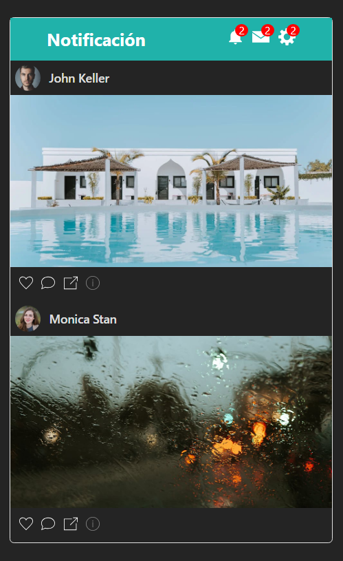

# Notificaciones App

## Descripción

**Notificaciones App** es una aplicación interactiva que permite a los usuarios recibir notificaciones en tiempo real. Utiliza **Socket.IO** para establecer una conexión en tiempo real entre el servidor y los clientes, facilitando la entrega inmediata de notificaciones.

La aplicación cuenta con un sistema de login y una interfaz sencilla, diseñada para que los usuarios puedan interactuar fácilmente con las notificaciones y otras funcionalidades básicas.
